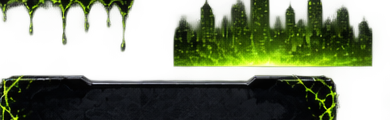

<div align="center">


<br/><br/>

[](https://www.python.org/)
[](https://streamlit.io/)
[](LICENSE)
[](#-author)

</div>

<br/>

## ✨ Features

- 🎮 **Four word categories** — Movies, Animals, Programming, Countries
- ⚔️ **Four difficulty tiers** — Easy, Medium, Hard, and a brutal 2-attempt **Pro** mode
- 💡 **Hint system** — 3 hints per round, each revealing one hidden letter
- ⌨️ **Physical keyboard support** — type on your real keyboard, not just the on-screen one
- 🔊 **Dynamic sound effects** — procedurally synthesized tones for correct/wrong guesses and a rising win fanfare, plus a real recorded losing sound (`assets/lose_laugh.mp3`)
- 🎆 **Win fireworks** — a canvas particle-burst animation on victory
- 🏆 **Achievements** — streak- and win-based badges (On Fire, Venom Slayer, Lethal Protector, Symbiote Bond, Flawless)
- 💾 **Persistent stats** — games played/won, streaks, and best streak survive app restarts via a local JSON file
- 📱 **Fully responsive** — a real mobile breakpoint reflows controls into a single column instead of squeezing them
- 🌑 **Full symbiote-themed UI** — custom fonts, toxic-green glow, drip lettering, and a full-page arena background

## 🖥️ Screenshots

| Gameplay | Category Select | Stats |
|---|---|---|
|  |  |  |

<sub>Swap these for real in-app screenshots when you have them — current images are placeholders from `assets/`.</sub>

## 🛠️ Tech Stack

| Layer | Technology |
|---|---|
| App framework | [Streamlit](https://streamlit.io/) |
| Language | Python 3.10+ |
| Styling | Custom CSS injected via `st.markdown` |
| Interactivity | JavaScript via `streamlit.components.v1.html` (keyboard bridge, fireworks canvas, audio playback) |
| Audio | Procedurally synthesized WAV tones (stdlib `wave` + `struct`) for correct/wrong/win, with a real recorded clip for the loss sound |
| Persistence | Flat local JSON file (`venom_stats.json`) — no database required |

## 🚀 Getting Started

### Prerequisites

- Python 3.10 or later
- pip

### Installation

```bash
git clone https://github.com/venom4664/venom-hangman-game.git
cd venom-hangman-game

python -m venv venv
venv\Scripts\activate        # Windows
# source venv/bin/activate   # macOS/Linux

pip install -r requirements.txt
```

### Run it

```bash
streamlit run app.py
```

Then open the local URL Streamlit prints — normally `http://localhost:8501`.

## 🎯 How to Play

1. Pick a **category** and **difficulty** from the top controls (or the sidebar).
2. Guess letters by clicking the on-screen keyboard **or typing on your physical keyboard**.
3. Use up to 3 **hints** per round if you get stuck.
4. Survive with attempts remaining to win — run out, and Venom wins instead.
5. Check the **Stats** page for streaks and achievements, and **Settings** to change difficulty or toggle sound.

## 📁 Project Structure

```
venom-hangman-game/
├── app.py                     # Main Streamlit application
├── requirements.txt           # Python dependencies
├── LICENSE
├── README.md
├── docs/
│   └── media/                  # README-only images (not loaded by the app)
│       ├── banner.png
│       └── future-levels.png
└── assets/                    # Runtime game assets, loaded by app.py
    ├── venom_head.png
    ├── venomicon.svg
    ├── logo.png
    ├── arena.png
    ├── sidebar.png
    ├── gallows.png
    ├── hint.png
    ├── slime.png
    ├── green_city.png
    ├── green_splash.png
    ├── venom_character.png
    ├── venom_mouth.png
    ├── hanging_character.png
    └── lose_laugh.mp3
```

## 🔮 Future Levels

<div align="center">

</div>

## 🤝 Contributing

Contributions, issues, and feature requests are welcome — open an issue or submit a pull request.

## 📄 License

Distributed under the MIT License. See [LICENSE](LICENSE) for details.

## 👤 Author

**Ahadu Gebresenbet**
GitHub: [@venom4664](https://github.com/venom4664)

<div align="center">
<sub>© 2026 — We are Venom. We don't lose.</sub>
</div>
